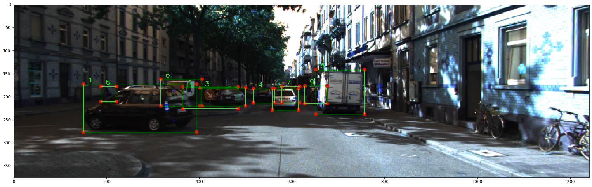

# Exploring kitti 3d object detection
This repository contains code and notebooks to explore the data.

## Notebooks

**Exploring the KITTI 3D object detection data set**

1. From directory structure to 2D bounding boxes [notebook](./notebooks/1%20From directory%20structure%20to%202D%20bounding%20boxes.ipynb)
